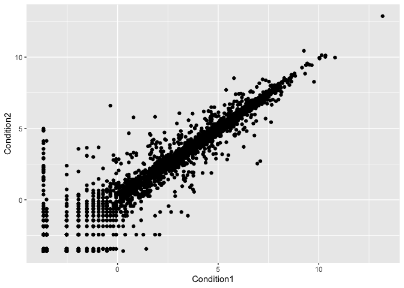
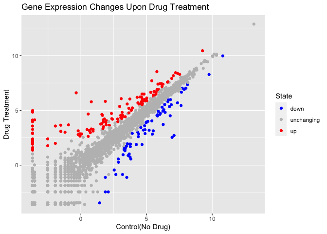
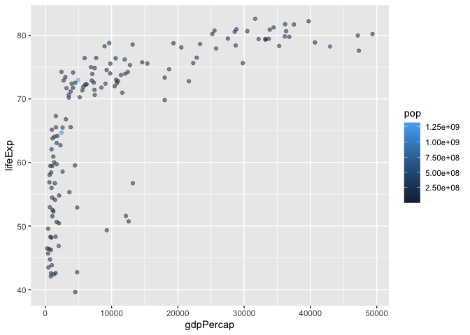

Class 5: Data Visualization
================
Andre

# Plotting in R

R has multiple plotting and graphics systems. The most popular of which
is **ggplot2**

We have already played with “base” R graphics. This comes along with R
“out of the box”.

``` r
plot(cars)
```


Compared to base R plots, ggplot is much more verbose - I need to write
more code to get simple plots like the one above.

To use ggplot, I need to first install the ggplot package. To install
any package in R I use `install.packages()` command along with the
package name. Do this in the console, not in your report.

The install we did above is a one time only requirement. The package is
now on our computer. I don’t need to re-install it.

However, I can’t just use it without loading it up with a `library()`
call

``` r
library(ggplot2)
```

``` r
ggplot(cars)
```


All ggplot figures need at least 3 things:

- data (this is the data.frame)
- aesthetics (“aes”, how our data maps on the plot)
- geoms (do you want lines, points, columns, etc…)

``` r
ggplot(data=cars) + aes(x=speed, y=dist) + geom_point()
```


I want a trend line to show the relationship between dist and speed.

``` r
ggplot(data=cars) + aes(x=speed, y=dist) + geom_point() + geom_line()
```


This is not what we want, we want a line of best fit so you have to use
geom_smooth

``` r
ggplot(data=cars) + aes(x=speed, y=dist) + geom_point() + geom_smooth(method= lm, se=FALSE)
```

    `geom_smooth()` using formula = 'y ~ x'


Now we will play around with the aesthetics to add more plots

First we are going to pull gene data from this url

``` r
url <- "https://bioboot.github.io/bimm143_S20/class-material/up_down_expression.txt"
genes <- read.delim(url)
head(genes)
```

            Gene Condition1 Condition2      State
    1      A4GNT -3.6808610 -3.4401355 unchanging
    2       AAAS  4.5479580  4.3864126 unchanging
    3      AASDH  3.7190695  3.4787276 unchanging
    4       AATF  5.0784720  5.0151916 unchanging
    5       AATK  0.4711421  0.5598642 unchanging
    6 AB015752.4 -3.6808610 -3.5921390 unchanging

To get more info from this data set like how many rows and columns there
are and their names

``` r
nrow(genes)
```

    [1] 5196

``` r
ncol(genes)
```

    [1] 4

``` r
colnames(genes)
```

    [1] "Gene"       "Condition1" "Condition2" "State"     

``` r
table(genes$State)
```


          down unchanging         up 
            72       4997        127 

Now we can plot this data by making a scatter plot (like we did above)
to compare condition1 to condition2 and then playing around with aes to
add more detail

``` r
ggplot(genes) + aes( x=Condition1, y=Condition2) + geom_point()
```



Now try and color code the data based on the State column and we can
switch the colors around with scale_colour_manual()

``` r
geneplot <- ggplot(genes) + aes( x=Condition1, y=Condition2, col=State) + geom_point()
geneplot + scale_colour_manual( values= c("blue", "gray", "red"))
```


``` r
geneplotcolored <- geneplot + scale_colour_manual( values= c("blue", "gray", "red"))
```

We can also add data lables and titles with labs()

``` r
geneplotcolored + labs(title="Gene Expression Changes Upon Drug Treatment", x="Control(No Drug)", y="Drug Treatment")
```



Now we turn to economic and demographic data that we can download from
an online souce

``` r
url <- "https://raw.githubusercontent.com/jennybc/gapminder/master/inst/extdata/gapminder.tsv"

gapminder <- read.delim(url)
```

To focus in on a single year in this data set with a bunch of years use
the dplyr code, you need to install it and pull it from the library and
use this code to focus in.

``` r
library(dplyr)
```


    Attaching package: 'dplyr'

    The following objects are masked from 'package:stats':

        filter, lag

    The following objects are masked from 'package:base':

        intersect, setdiff, setequal, union

``` r
gapminder_2007 <- gapminder %>% filter(year==2007)
```

Now make a basic scatter plot and use the alpha call to make the points
kind of transparent to better visualize them

``` r
ggplot(gapminder_2007) + aes(x=gdpPercap, y=lifeExp) + geom_point(alpha=0.5)
```


We can add variabes using color for continent and size for population

``` r
ggplot(gapminder_2007) + aes(x=gdpPercap, y=lifeExp, color=continent, size=pop) + geom_point(alpha=0.5)
```


We can also use pop as a color metric and get a scale

``` r
ggplot(gapminder_2007) + aes(x=gdpPercap, y=lifeExp, color=pop ) + geom_point(alpha=0.5)
```



We can also adjust the point size if we make population a size metric
using scale_size_area(max_size = \_\_\_)

``` r
ggplot(gapminder_2007) + aes(x=gdpPercap, y=lifeExp, size=pop ) + geom_point(alpha=0.5) + scale_size_area(max_size = 10) 
```


Now we can use the same steps we did above to make another plot and set
them side by side to each other using facet_wrap(\~year)

``` r
library(dplyr)
gapminder_1957 <- gapminder %>% filter(year==1957 | year==2007)
ggplot(gapminder_1957) + aes(x = gdpPercap, y = lifeExp, color=continent, size=pop ) + geom_point(alpha=0.7) + scale_size_area(max_size = 10) + facet_wrap(~year)
```


